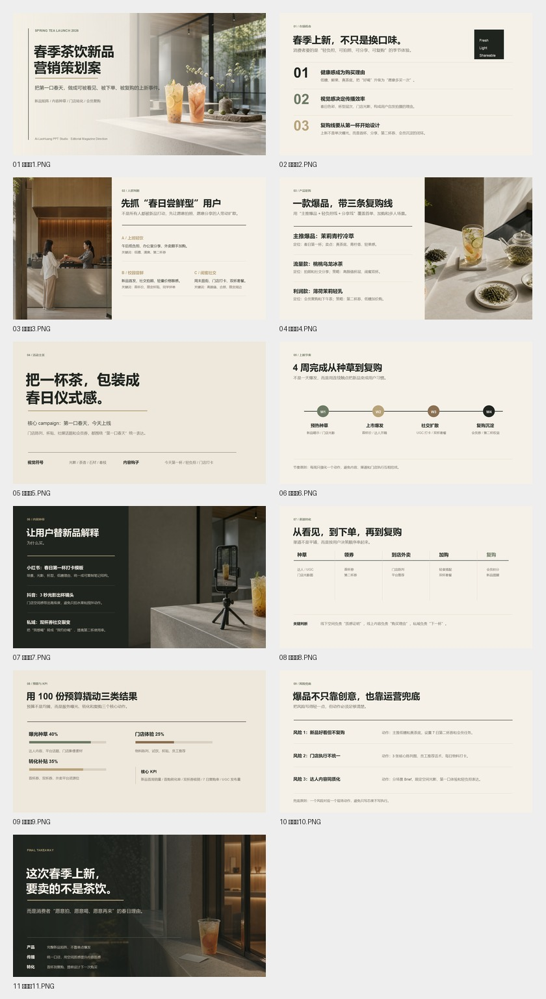

# Ai-LaoHuang PPT Studio

> AI-powered Chinese commercial PPT production workflow for generating editable PowerPoint decks from topics, documents, SVG pages, native slide objects, templates, and image assets.

<p align="center">
  
  
  
  
</p>

Ai-LaoHuang PPT Studio is a **Chinese-first business presentation skill** built for real client-facing decks: marketing plans, product launches,招商/路演, course decks, consulting reports, brand proposals, and internal business reviews.

It is not a screenshot deck generator. The core workflow creates **structured SVG pages**, then exports them into PowerPoint as **editable text, shapes, lines, images, diagrams, and native slide objects** whenever possible.

## Showcase

**Spring Tea Launch Editorial Proposal**

An example deck in an editorial magazine direction: architecture photography, calm typographic grid, low saturation palette, generous negative space, and commercial proposal structure.



| Asset | Path |
|---|---|
| Final PPTX | [`examples/spring-tea-launch-editorial/exports/spring-tea-launch-editorial-fixed-tripod-final.pptx`](examples/spring-tea-launch-editorial/exports/spring-tea-launch-editorial-fixed-tripod-final.pptx) |
| Preview contact sheet | [`examples/spring-tea-launch-editorial/preview/contact-sheet.jpg`](examples/spring-tea-launch-editorial/preview/contact-sheet.jpg) |
| Source SVG pages | [`examples/spring-tea-launch-editorial/svg_output/`](examples/spring-tea-launch-editorial/svg_output/) |
| Image assets | [`examples/spring-tea-launch-editorial/images/`](examples/spring-tea-launch-editorial/images/) |
| Design spec | [`examples/spring-tea-launch-editorial/design_spec.md`](examples/spring-tea-launch-editorial/design_spec.md) |

## What It Does

| Capability | Description |
|---|---|
| Topic-to-deck | Turn a brief such as “春季茶饮新品营销策划案” into a structured commercial presentation. |
| Document-to-deck | Convert PDF, DOCX, PPTX, Excel, Markdown, HTML, and web sources into presentation material. |
| Editable PPTX output | Export text, rules, shapes, diagrams, images, and many layout objects as editable PowerPoint content. |
| SVG-first design | Author each slide as a high-fidelity SVG page, then convert it into PPTX. |
| Commercial style direction | Build decks in styles such as editorial magazine, Swiss grid, Memphis pop, tech keynote, consulting report, brand proposal, and more. |
| Image asset workflow | Use generated or local images as deck assets without turning the whole page into a flat screenshot. |
| Template system | Includes layout templates, chart templates, brand presets, icon libraries, and reference design specs. |
| QA workflow | Finalize SVG, export PPTX, inspect slide count/media/text/shape counts, and render previews for visual review. |

## Workflow

```text
Brief / Source Document
        ↓
Content Extraction
        ↓
Deck Strategy + Style Direction
        ↓
SVG Page Authoring
        ↓
Image / Icon / Chart Asset Processing
        ↓
SVG Finalization
        ↓
Editable PPTX Export
        ↓
Preview + QA
```

## Quick Start

### 1. Install dependencies

```bash
pip install -r requirements.txt
```

On Windows, use `python` if `python3` is not available.

### 2. Create a project

```bash
python scripts/project_manager.py init spring-tea-launch --format ppt169
```

### 3. Import source material

For source files:

```bash
python scripts/project_manager.py import-sources outputs/spring-tea-launch <your-source-file> --move
```

For a topic-only deck, write the brief into the project and continue with the strategy/SVG workflow described in [`SKILL.md`](SKILL.md).

### 4. Finalize SVG pages

```bash
python scripts/finalize_svg.py outputs/spring-tea-launch
```

### 5. Export editable PPTX

```bash
python scripts/svg_to_pptx.py outputs/spring-tea-launch
```

The exported deck will be written to:

```text
outputs/<project-name>/exports/
```

## Source Conversion

| Source | Script |
|---|---|
| PDF | `scripts/source_to_md/pdf_to_md.py` |
| DOCX / Word / HTML / EPUB | `scripts/source_to_md/doc_to_md.py` |
| XLSX / XLSM | `scripts/source_to_md/excel_to_md.py` |
| PPTX | `scripts/source_to_md/ppt_to_md.py` |
| Web page | `scripts/source_to_md/web_to_md.py` |

## Repository Structure

```text
.
├── SKILL.md                         # Codex skill entry and full workflow protocol
├── scripts/                         # Source conversion, SVG finalization, PPTX export, QA helpers
├── templates/
│   ├── brands/                      # Brand presets
│   ├── charts/                      # Chart and infographic SVG templates
│   ├── icons/                       # Icon libraries
│   └── layouts/                     # Deck layout templates
├── references/                      # Strategy, execution, image, and visual review references
├── workflows/                       # Optional workflows: topic research, live preview, chart verification
└── examples/
    └── spring-tea-launch-editorial/ # Public showcase deck
```

## Design Directions

The skill can be guided by explicit visual language, for example:

- `Editorial Magazine — architecture photography, calm typographic grid`
- `Swiss Grid — strict modular grid, restrained type, red-accent`
- `Memphis Pop — bold primaries, geometric patterns, playful energy`
- `Consulting Report — dense logic, sober charts, executive clarity`
- `Commercial Proposal — product imagery, structured value argument, polished close`

## Example Prompts

```text
用 Ai-LaoHuang PPT Studio 做一份春季茶饮新品营销策划案，
12 页，风格 Editorial Magazine / architecture photography / calm typographic grid，
要有图片，但文字和图形尽量可编辑。
```

```text
把这个 PDF 整理成一份 10 页汇报 PPT，
风格 Swiss Grid，黑白灰为主，红色强调，输出可编辑 PPTX。
```

```text
做一份 Claude Code 老黄版产品介绍，
风格 Memphis Pop， bold primaries，geometric patterns，playful energy。
```

## Quality Standard

A deck is considered successful only when:

- slide count matches the planned outline
- major text remains editable in PowerPoint
- diagrams and layout primitives are not flattened unnecessarily
- image assets are embedded intentionally and not repeated accidentally
- preview images show no obvious overlap, missing glyphs, broken crops, or unreadable text
- exported PPTX can be opened and inspected

## Relationship To PPT Master

Ai-LaoHuang PPT Studio is a branded derivative workflow based on `hugohe3/ppt-master` under the MIT License. This repository keeps upstream license notices in [`LICENSE`](LICENSE) and [`NOTICE`](NOTICE).

The Ai-LaoHuang layer focuses on:

- Chinese commercial PPT scenarios
- client-facing deck polish
- style direction and page rhythm
- editable PPTX delivery
- showcase-ready examples

## Roadmap

- More public showcase decks across business styles
- Lightweight install package without the full reference image set
- More reusable Chinese commercial page templates
- Built-in preview gallery for generated decks
- Stronger PPTX QA reports and visual diff checks

## License

MIT. See [`LICENSE`](LICENSE) and [`NOTICE`](NOTICE).
